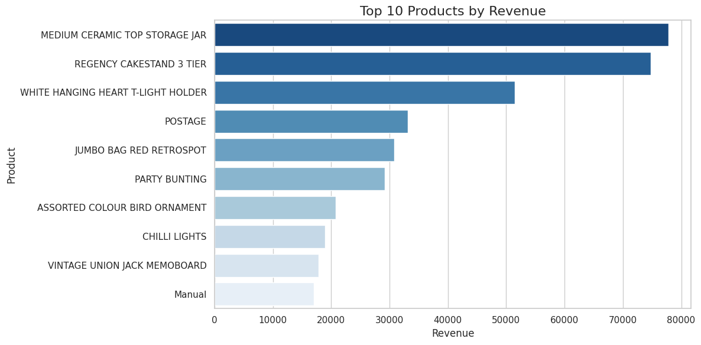
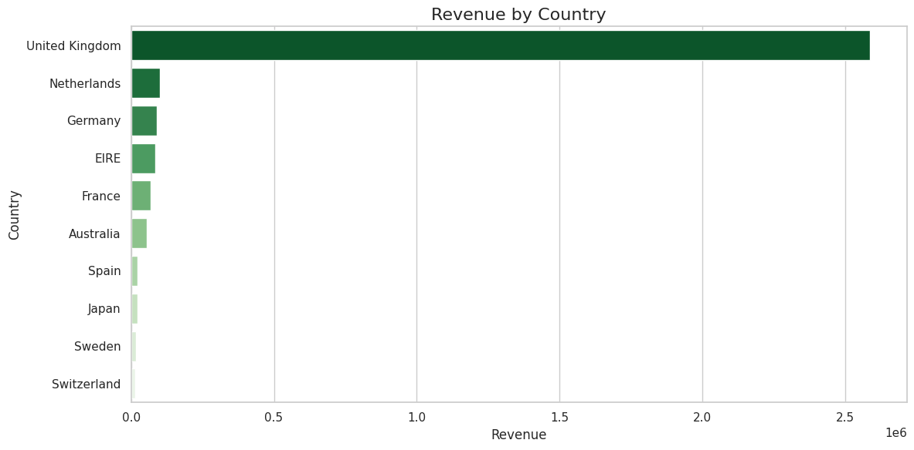
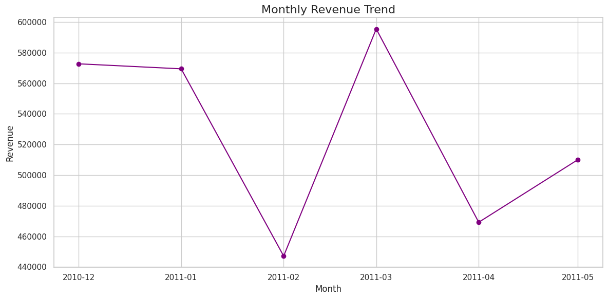
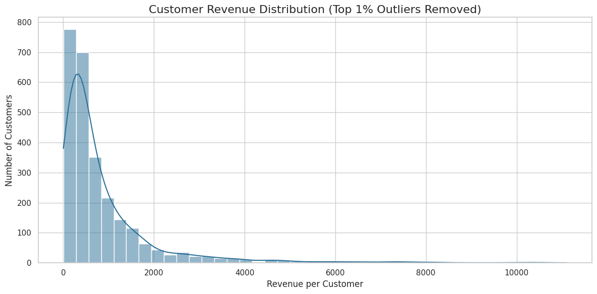
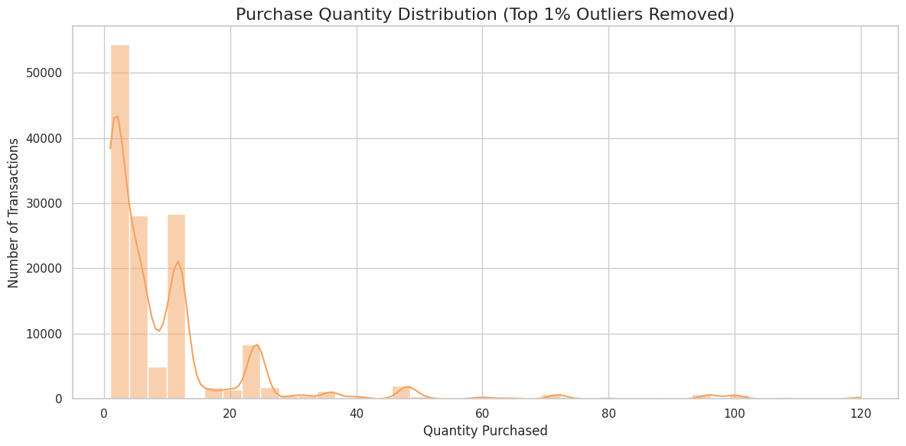

# E-Commerce Sales Analysis

## Project Overview

This project analyzes transactional sales data from an online retail store to understand product performance, customer purchasing behavior, and geographic revenue distribution.

The objective is to transform raw sales records into actionable insights that support business decisions related to inventory management, marketing strategy, and customer targeting.

---

## Dataset

The dataset contains transaction-level retail data with the following fields:

| Column      | Description                   |
| ----------- | ----------------------------- |
| InvoiceNo   | Unique transaction identifier |
| StockCode   | Product identifier            |
| Description | Product name                  |
| Quantity    | Units purchased               |
| InvoiceDate | Date and time of purchase     |
| UnitPrice   | Price per unit                |
| CustomerID  | Customer identifier           |
| Country     | Customer location             |

Revenue was calculated using:

Revenue = Quantity × UnitPrice

---

## Tools Used

* Python (Pandas, Matplotlib, Seaborn)
* SQL for analytical queries
* GitHub for version control and project documentation

---

## Key Insights

### Top Products by Revenue



A small number of products contribute a large share of overall revenue, indicating strong demand concentration.

---

### Revenue by Country



Sales are heavily concentrated in a few countries, suggesting key geographic markets.

---

### Monthly Revenue Trend



Revenue trends over time help identify growth patterns and potential seasonality.

---

### Customer Revenue Distribution



Customer spending distribution highlights the presence of high-value customers.

---

### Purchase Quantity Distribution



Most purchases involve small quantities, with occasional bulk purchases.

---

## Business Recommendations

Based on the analysis:

* Prioritize inventory management for top-selling products
* Focus marketing efforts on high-revenue markets
* Monitor high-value customers for retention strategies
* Track purchase trends to improve demand forecasting

---

## Project Structure

```
Ecommerce-Revenue-Analysis
│
├ dataset
│   ecommerce_sales.csv
│
├ python
│   analysis.ipynb
│
├ sql
│   queries.sql
│
├ report
│   report.md
│
├ images
│   top_products_ecomerce.png
│   revenue_by_country.png
│   monthly_revenue_trend.png
│   customer_revenue_distribution.png
│   Quantity_distribution.png
│
└ dashboard
```
